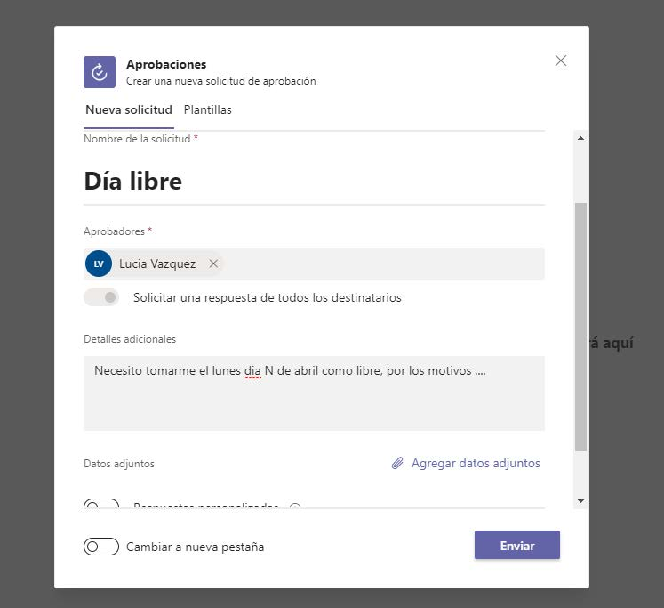
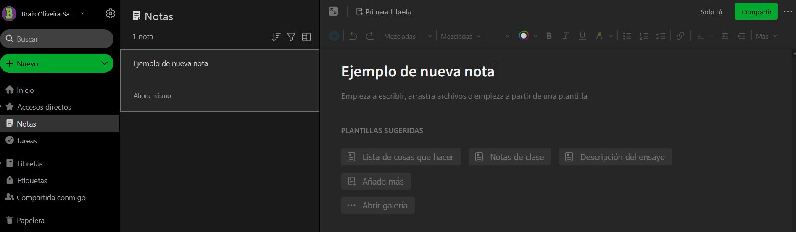
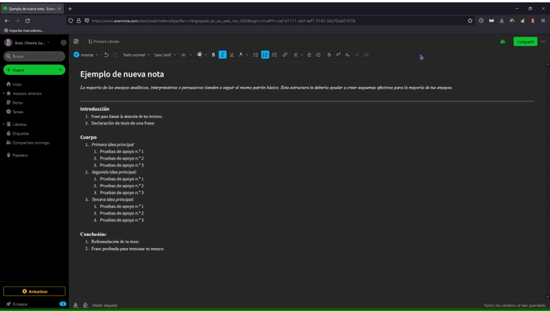

# PEC3: Visionando el futuro con las gafas de Manovich 

### Evernote y Microsoft Teams 

Autor: Brais Oliveira Sanjurjo

Fecha: 

## Planteamiento

 La hibridación de medios es la Estrella Polar que guía la vanguardia del software de principios del siglo XXI. 
 
 *Hibridación* es el término escogido por Lev Manovich en su libro *El software toma el mando* para señalar un paso adelante en la integración de medios con respecto al término *multimedia*, utilizando leyes de la genética mendeliana como metáfora para abordar los procesos de variabilidad y modularidad.

 >*"(...)la  biología  evolutiva  nos  proporciona  un  modelo  del  espacio  de  los objetos, mucho más amplio, cuyas identidades se superponen. Este modelo encaja mucho mejor con mi teoría de la cultura del software como un conjunto amplio y en continuo crecimiento  de  técnicas  que  pueden  combinarse  de  muchas  maneras,  en  forma  de aplicaciones, y proyectos/productos creados para ellas, o a través de una programación personalizada" - Lev Manovich (El software toma el mando, 2013)*

De esta manera, mientras los programas multimedia vienieron a ofrecer un biotopo adecuado para la convivencia de diferentes lenguajes, los programas híbridos remezlcan estos medios para fundirlos, dando como resultado un nuevo metalenguaje.

En el presente ensayo veremos los casos de dos programas enfocados en la productividad para tareas de escritorio, **Microsoft Teams** y **Evernote**, encuadrados dentro el paradigma de hibridación de medios.

## Re-descubriendo la hibridacion: Microsoft Teams

Productividad desde cualquier lugar, desde cualquier dispositivo, en cualquier momento. Eso es lo que propone Microsoft 365, un compendio de herramientas que han ido evolucionando sin detenerse hasta nuestros días, alcanzando un nivel de madurez que las convierten en patrón oro en cuanto a trabajo colaborativo empresarial. Una de estas herramientas es Teams.

Teams es un área de trabajo virtual, una oficina completa desde la que comunicarse de manera asíncrona (chat directo, chat grupal, mensajes de texto en grupos y canales) o hacer videoconferencias *N a N*.

En Teams está integrada toda la suite de MS Office.

¿Dónde se guardan finalmente estos documentos en los que se está trabajando en Teams?
Microsoft 365 se basa en la nube **Azure**. Dentro de la nube existen dos localizaciones, SharePoint y OneDrive.

#### 

Es una intranet corporativa para almacenar archivos de trabajo o crear páginas web para mostrar contenido. Al ser accesible desde internet no hace falta VPN para acceder a los contenidos, como sucede con otro tipo de implantaciones *on-premise*. El alamacenamiento ofrecido en la versión más habitual es de 25Tb. 
Cada equipo de Teams crea su respectivo enlace en SharePoint.

#### 

OneDrive está pensado para que el usuario guarde sus documentos de trabajo. Es un disco duro virtual sincronizado para ser accesible desde internet con 1Tb de capacidad por usuario.

Por hacer un símil sencillo, en SharePoint se guarda lo que se almacenaría en el servidor, en OneDrive se guarda lo que los usuarios tendrían en el disco duro de su PC.

Se puede acceder desde navegador o sincronizar con el explorador de archivos de Windows o el Finder de Mac OS dependiendo de las preferencias del usuario.
Los administradores tienen acceso a esta información en todo momento, incluso pueden dar permisos a un usuario no administrador para que acceda en tiempo real al OneDrive de otro.
Los archivos en la nube pueden tener una copia sincronizada en los ordenadores para acceder a ella en momentos en los que no hay conexión a Internet. En el momento en que se recupere la conexión, se actualiza el documento en la nube.

### Análisis rápido de Teams

 FICHA  |   |
| -- | -- |
| Género | **Ofimática** |
| Desarrollador | **Microsoft Corporation** |
| Fecha de lanzamiento | **14 Marzo 2017** |

Teams es una oficina llevada al terreno intangible pero habitable de lo virtual. En una sociedad que tiende cada vez más y por diferentes motivos a la deslocalización del entorno laboral, integra todo lo que en el pasado eran diferentes aplicaciones corriendo en el *metamedio ordenador* y en una sola aplicación, creando una experiencia en la que para un usuario no técnico, se antoja difícil saber donde termina un software y comienza otro.

La estructura de Teams es la siguiente

__Equipos__ 

Se crean según intereses comunes (proyectos fijos, temporales, ...)

__Canales__

Se usan para organizar los equipos. Siempre hay un canal General y después se van creando otros
específicos. Estos pueden ser estándar, todo el equipo tiene acceso al canal; o privados, en los que se especifica quien tiene acceso.

__Chat__

Mientras que las conversaciones en los canales se conceptualizan como públicas para cualquiera que tenga acceso al canal, el chat es una conversación privada entre un grupo indeterminado de personas.

__Llamadas y reuiniones__

Teams está integrado con el calendario de Outlook (cliente de correo de Microsoft) para que se puedan agendar reuniones o llamadas.
Esto también se puede hacer desde la propia aplicación de Teams.
 
### Algunos usos potenciales

Dentro de Teams se integra una cantidad inabarcable de aplicaciones de mucha utilidad y que ofrecen soluciones a la práctica totalidad requerimientos de una oficina, tanto presencial como de trabajo remoto.

Se han seleccionado algunas para analizar como ejemplo.

#### Office

Todas las aplicaciones de MS Office excepto Access tienen integración nativa en Teams. Se puede editar directamente sin salir de la aplicación, aunque para desarrollos complejos en Excel, sigue siendo mejor la experiencia en la aplicación de escritorio para la mayor parte de usuarios.

#### Task Planner

Aplicación muy completa para gestionar tareas pendientes. Se utiliza como un tablón al que se van
añadiendo tareas y se van asignando a un técnico. Las tareas pueden no ser asignadas a nadie y la propia
gente se las va asignando a si mismos cuando pueden afrontarlas.
También se puede establecer prioridades, actualizar los progresos y poner fecha de entrega o resolución. Es una aplicación que se le puede sacar mucho provecho ya que cuando algo se resuelve, gracias a las actualizaciones queda un repositorio de conocimiento con soluciones a incidencias.

#### Aprobaciones

Aplicación para pedir aprobación a un responsable de cualquier tema relacionado con procesos de cualquier índole.
Aunque este proceso ya se esté llevando con éxito vía correo electrónico, es una opción que ejemplifica como Teams puede llegar a ser una oficina virtual con todo lo que se pueda necesitar.Bl

#### Forms

Es una aplicación que se usa bastante para hacer encuestas de satisfacción, filtros previos para candidatos a puestos laborales, etc.
La posibilidad de personalización de la imagen de estas encuestas no es infinita, se puede cambiar la paleta de colores y la fuente, pero no toda la interfaz puede ser personalizada como se hace por ejemplo al añadir CSS propio a un tema de WordPress. Se envía por correo el formulario y los resultados pueden volcarse en formato CSV para su análisis posterior.

#### GitHub

Herramienta para el control de versiones de código fuente que es básica en el desarrollo de software y se está usando también para otros procesos colaborativos como el diseño gráfico.

Para no expandirme más, ya que creo que ha quedado claro la cantidad virtualmente ilimitada de aplicaciones que se integran en Teams, finalizo con un caso realmene curioso.

#### Draw.io

Aplicación para hacer diagramas de procesos exportables en diferentes formatos. Es un programa muy usado en instituciones como facultades de informática para diagramar bases de datos o UML de cualquier tipo. Tiene un buen banco de imágenes dependiendo de la materia sobre la que se esté trabajando (electrónica, ingeniería de software, planos de planta...)
Funciona de manera similar a Visio, programa de Microsoft que sin embargo no tiene integración en Teams. Podría pensarse en que es porque Visio se licencia por separado y no está incluído en ninguna licencia Microsoft 365, pero no parece esta una limitación real, teniendo en cuenta que otros programas que sí tienen buena integración, como Acrobat de Adobe, funcionan mediante login para comprobar la vigencia de la licencia.

---

## Re-descubriendo la hibridacion: Evernote
 

Evernote es una aplicación de notas digitales multimedia, centrada en la organización de información y actividad diaria. Se puede usar de tres maneras.

- Aplicación móvil
- Aplicación de escritorio
- Navegador web

Dentro de su segmento de mercado compite con otras aplicaciones como Notion, aunque Evernote está reconocida como una de las mejores en el campo de organización de notas.
Si bien puede ser utilizada por profesionales de diferentes ámbitos, no está pensada para entornos empresariales de gran tamaño.
Tiene un nicho de mercado muy claro en estudiantes y empleados autónomos.

¿Dónde se guardan finalmente estos documentos manejados por Evernote?
En el pasado, Evernote emplazaba toda esta documentación en su propio CPD, sin embargo, con el crecimiento del proyecto el sistema se volvía difícilmente escalable.
Hoy en día, confían la tarea de alamacenamiento a *Google Cloud Platform*. 

### Análisis rápido de Evernote

 FICHA  |   |
| -- | -- |
| Género | **Organizador de notas** |
| Desarrollador | **Stepan Pachikov** |
| Fecha de lanzamiento | **23 Junio 2008** |

Se estructura en base a **notas** que se agrupan en **libretas**, y a las que se pueden otorgar **etiquetas** que actúan como metadatos útiles para el filtrado en futuras búsquedas ya que se pueden dar las mismas etiquetas a notas que están en libretas distintas.

## Algunos usos potenciales

#### Compartir notas

Funcionalidad de trabajo colaborativo, que nos permite enviar un enlace a una nota concreta a otro usuario que tenga cuenta en el programa.

#### Esbozar

Es una herramienta que permite realizar dibujos utilizando el ratón y a mano alzada si se dispone de tableta digitalizadora o pantalla táctil. Las opciones son limitadas para un artista, pero suficientes para un estudiante re-mediando una libreta.

### Post-it

Colaboración entre la empresa 3M y Evernote para llevar el buque insignia de 3M del mundo analógico al digital.
Básicamente consiste en utilizar la cámara de un smartphone donde esté instalado el programa Evernote para escanear un Post-it (preferentemente en formato cuadrado de 3 o 9 centímetros de lado y de los colores amarillo, rosa, azul o lima).
La IA puede diferenciar hasta 200 Post-it por escaneo, y aunque no se promociona oficialmente, es posible escanear documentos como un bloc de notas o una pizarra.

## Conclusiones

Basten los ejemplos anteriores como base analítica que nos pone en contexto sobre como la evolución del software de productividad y ofimática recorre la senda de la hibridación. 
En todos los casos analizados se aprecian nuevas maneras de interaccionar con medios previamente existentes, bajo un modelo de **hibridación por yuxtaposición**, esto es, un tipo de software en el que proceso de hibridación no pretende ser "invisible". 
### Teams
En el caso de **Teams**, donde se re-median gran cantidad  de procesos gracias a que Microsoft fomenta la **modularidad** en forma de plugins de desarrolladores externos, el caso paradigmático de hibridación, sería el que nos situa en un marco de trabajo colaborativo.

Pensemos en el ejemplo de añadir una tabla de Excel en una hoja de Word. Esto no es nuevo. 

Pero ahora estaríamos hablando de:
- poner una tabla Excel en un Word mientras presentamos el proceso en directo por videoconferencia 
- con un grupo de personas que podrían estar editando el texto a su vez
- pudiendo interactuar en un chat 
- con botones habilitados en la interfaz para:
  - *levantar la mano* para pedir la palabra
  - silenciar el propio entorno, o no oir a los compañeros sin salir de la reunión
  - *blurear* o simular diferentes fondos tras nuestra figura

Todo desde una única aplicación de software y desde cualquier parte del planeta y con una experiencia de usuario que necesita una curva de aprendizaje realmente pequeña.

Estamos, por lo tanto, ante un caso en el que Teams re-media procesos analógicos, añadiendo funcionalidades nuevas que optimizan procesos. Veamos que gente que esté en la misma oficina, debería simular que trabaja en remoto para ser más eficiente.

Por otro lado, no existe un marco diferenciado en el proceso para cada medio. Al contrario que en la **multimedia** tradicional, todo se produce en un mismo canal y de manera simultánea.

### Evernote

El ejemplo que seleccionamos en este caso es el de la funcionalidad de Post-it.

Post-it es un producto de oficina destinado a la toma de notas rápidas, lo que lo alinea claramente con Evernote. Lo curioso es que Post-it ha sido tradicionalmente un medio de notas informal, destinadas estas a desaparecer en breve lapso de tiempo, o cuando menos a no ser archivadas ni organizadas de manera escrupulosa — mención a parte merecen las contraseñas pegadas al monitor, y otros tipos de Post-it perennes —.

Es un caso de hibridación con estructura de datos digitales continuos (mapa de bits) obtenidos desde una estructura analógica concreta (papel).

Por lo tanto, este modelo simula un medio físico preexistente representándolo numéricamente para después otorgarle nuevas funcionalidades, como ser archivado siguiendo un patrón establecido por el usuario y guardado en la nube para su posterior acceso. 

Evernote pone de relieve con esta aplicación el valor que sigue teniendo la toma de notas manuales, de manera que lejos de competir, como cabría esperar, colabora con el proceso e intenta fundir la experiencia analógica y digital de manera orgánica, en un proceso lo más natural posible que parece seguir el enfoque lamarckiano de evolución, en el cual las nuevas capacidades aparecen de la necesidad concreta y existe un impulso vital hacia la perfección. 

Finalmente, valorar desde el año 2022 a donde nos va a llevar este proceso en los años venideros puede resultar complejo, teniendo en cuenta la propia naturaleza de la hibridación de software.

Según se viene apuntando, campos como la realidad aumentada, realidad virtual, gemelos digitales e IoT ya están siendo clave y van a seguir aumentando su presencia e influencia en las vidas de la gente, pero también cabría esperar que incluso estas materias que ahora mantienen un marco más o menos definido, acabarán hibridando entre ellas para traer nuevos modelos ahora insospechados.

El lenguaje, la posibilidad de comunicarnos, hizo de nosotros lo que somos como especie. Hace gran parte de lo que somos como personas, integrándonos en una red de otros seres a los que nosotros damos forma y de los que tomamos forma.

El software que tantas veces se representa como algo novedoso, no es más que la pulsión comunicativa que siempre nos ha caracterizado, refinada a través de milenios. Somos nosotros escribiendo. Ni más ni menos. 

Lo que sí se puede asegurar sin ningún género de dudas, es que vamos a seguir escribiendo, vamos a seguir comunicando cosas a nuestros semejantes y vamos a crear no solo lo que necesitemos, si no lo que sea posible. Porque es algo que está en nuestro ADN. Si algo se puede hacer, será hecho. Y casi nada se hace de una pieza ya. Todo es híbrido.

### Referencias y Bibliografía

* Manovich, Lev. (2013). **El Software toma el mando**. Barcelona: Editorial UOC.

* Matewecki, Natalia. **Hibridaciones visibles e invisibles en arte y medios**. Universidad Nacional de la Plata: Facultad de Bellas Artes. http://sedici.unlp.edu.ar/bitstream/handle/10915/40562/Documento_completo.pdf?sequence=1

* **Le damos la vienvenida a Microsoft Teams**. Microsoft Docs. https://docs.microsoft.com/es-es/microsoftteams/teams-overview

* **Datadog: Cómo ofrecer a Evernote una visibilidad sin precedentes para servicios competitivos en la nube**. Google Cloud. https://cloud.google.com/customers/evernote?hl=es-419

* **Remediación, multimedia e hibridación de los medios**. Ferrán Andell. http://multimedia.uoc.edu/blogs/fem/es/remediacio-multimedia-i-hibridacio-dels-mitjans/

* **PEC3_Manovich_Reloaded**. Laura Orma (2022). https://github.com/LauraOrma/PEC3_Manovich_Reloaded

---

Licencia: Material Creative Commons desarrollado bajo licencia CC BY-SA 4.0. Imágenes CC BY [Wikimedia Commons](https://commons.wikimedia.org/wiki/Main_Page) 
